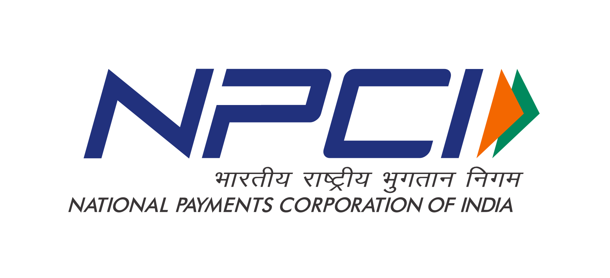

# SmartToll: AI-Powered Digital Tolling for Seamless Transactions - NPCI Hackathon (Mumbai Tech Week)

## Overview
This repository contains the source code and documentation for our project submitted to the **NPCI Hackathon** as part of **Mumbai Tech Week**. The project aims to leverage cutting-edge technology to enhance digital toll payment solutions and financial inclusion, specifically focusing on seamless integration with existing NPCI infrastructure paradigms.

## Introduction
The **NPCI Hackathon** conducted during **Mumbai Tech Week** challenges developers to build innovative solutions that improve financial transactions, security, and digital payments in India. Our project, **"SmartToll: AI-Powered Digital Tolling for Seamless Transactions,"** focuses on enhancing the user experience of digital toll payments through AI-driven dynamic pricing, smart lane allocation, and seamless UPI integration concepts. By leveraging real-time traffic data and machine learning, we aim to create a more efficient and user-friendly tolling system that aligns with NPCI's vision for a digitally empowered India.

## Key Features

### 1. Dynamic Pricing

* **Concept:** Real-time adjustments of toll charges based on traffic demand to incentivize off-peak travel.
* **Mechanism:**
    * Continuous monitoring of traffic volume, speed, and density using sensors and cameras.
    * Algorithm-driven calculation of optimal toll prices using a Gradient Descent model.
    * Implementation of discounts during low-traffic periods and potential surcharges during peak hours.
    * Optimization of tax collection versus faster travel trade-offs using gradient descent (GD) with features like time of day, day of week, weather, and historical traffic data.
* **Benefits:**
    * Reduces peak-hour congestion.
    * Improves overall traffic flow and travel times.
    * Optimizes revenue generation.

### 2. Dynamic Lane Allocation

* **Concept:** Real-time adjustment of lane assignments based on traffic direction.
* **Mechanism:**
    * Real-time monitoring of traffic flow and queue lengths.
    * Algorithm-based determination of optimal lane configuration.
    * Automated lane switching using barriers or electronic signs.
    * Parameter consideration: Lane wait time, existing traffic volume, vehicle type, and predicted traffic flow.
* **Benefits:**
    * Reduces congestion and wait times.
    * Improves traffic flow efficiency.
    * Adapts to fluctuating traffic patterns.

### 3. Booth Allocation

* **Concept:** Optimization of open toll booths based on the ratio of incoming and outgoing traffic.
* **Mechanism:**
    * Traffic flow monitoring in both directions.
    * Algorithm-based calculation of traffic ratio.
    * Automated booth opening/closing.
* **Benefits:**
    * Reduces wait times at booths.
    * Improves operational efficiency.
    * Optimizes staff usage.

### 4. Smart Toll Plaza Allocation Based on Congestion & Travel Direction

* **Concept:** AI-driven dynamic assignment of vehicles to toll plazas and lanes.
* **Mechanism:**
    * Real-time congestion analysis using AI algorithms.
    * Route prediction based on GPS and historical data.
    * Dynamic lane assignment.
    * Automated lane switching within multi-plaza toll booths.
* **Benefits:**
    * Significantly reduces toll plaza congestion.
    * Improves travel times.
    * Enhances overall traffic flow.

### 5. Concessions & Discounts for Eco-Friendly Vehicles

* **Concept:** Incentivizing the use of electric vehicles (EVs) and low-emission vehicles.
* **Mechanism:**
    * Green number plate recognition using image processing.
    * Automatic discount application through integrated UPI/FASTag systems.
    * Priority lanes or express clearance.
* **Benefits:**
    * Promotes eco-friendly vehicle adoption.
    * Reduces air pollution.
    * Supports sustainability.

## Further Improvements

### 6. Fast-Track Payment & Digital Tolling Solutions

* **Concept:** Streamlining toll payments using advanced technologies.
* **Mechanism:**
    * RFID-based payment (FASTag) with improved AI validation.
    * UPI integration for seamless, real-time payments.
    * AI-powered FASTag validation for fraud detection.
    * Mobile-based tolling with GPS prepayment and route optimization.
* **Benefits:**
    * Reduces wait times.
    * Enhances payment convenience.
    * Improves transaction efficiency.
    * Reduces fraud.

### 7. Predictive Maintenance for Toll Infrastructure

* **Concept:** AI-driven prediction of maintenance needs.
* **Mechanism:**
    * Sensor data collection on equipment performance.
    * AI-based data analysis using time-series forecasting.
    * Predictive maintenance scheduling.
* **Benefits:**
    * Reduces downtime and maintenance costs.
    * Improves equipment reliability.
    * Increases infrastructure lifespan.

## Tech Stack

* **AI/ML:** Python (3.9), TensorFlow (2.7), Scikit-Learn (1.0), OpenCV (4.5), Pandas, NumPy.
* **Backend:** Flask (1.1), PostgreSQL (13).
* **DevOps:** Docker (20.10), AWS EC2, AWS RDS.
* **Payment Integration:** Conceptual UPI/FASTag Integration.

## Dataset

* **Source:** Provided by NPCI for the Hackathon.
* **Preprocessing Steps:** Data cleaning, normalization, feature engineering (time-based features, weather features), and splitting into training/testing sets.
* **Usage:** Used for training machine learning models for dynamic pricing and traffic prediction.

## Model Performance

* Multiple model metrics were used for different features, including RMSE, MAE, and R-squared.
* Plots and visualizations of original and working data are available in the `plots/` folder of the repository.

## Scalability

* The models and system architecture are designed to be scalable, capable of handling a large volume of transactions and data.

## Future Enhancements

* Implement real-time data integration with live toll plaza data.
* Improve fraud detection using advanced machine learning techniques.
* Expand mobile application functionality for enhanced user experience.
* Integration with other NPCI services.

## Team Members

* Aarav Mody
* Aditya Deshpande
* Luvv Swami
* Presha Karan 
